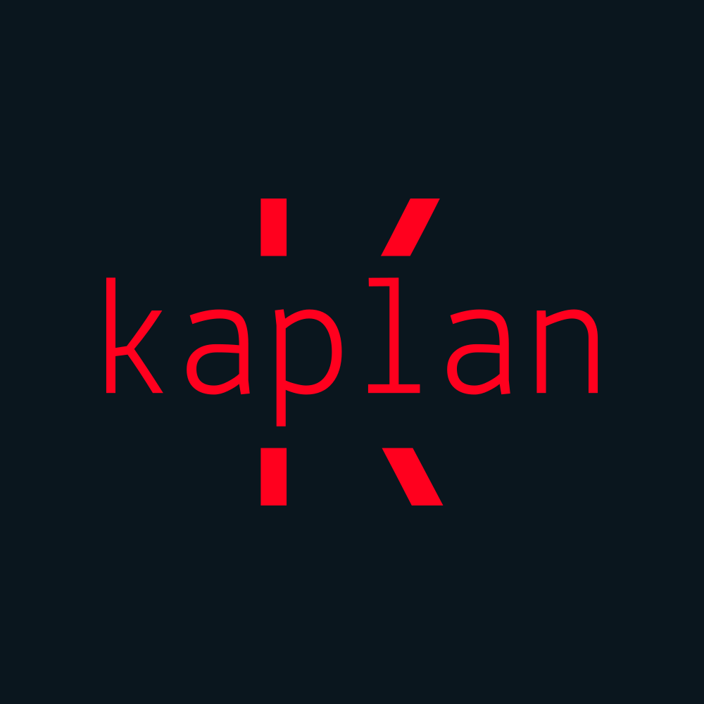

# KaplanVPN

[](https://github.com/nadrelaxe/KaplanVPN)
[](https://github.com/nadrelaxe/KaplanVPN/blob/master/LICENSE)
[](https://lbesson.mit-license.org/)
[](https://github.com/nadrelaxe/KaplanVPN/)

[](https://code.visualstudio.com/)
[](https://https://docker.com/)


<p align="center">
   
</p>

KaplanVPN is a shell script and resources to deploy a plug-and-play privacy environment. It is easy to maintain with Portainer that allows to see the docker containers through web-ui.

It will also deploy Wireguard VPN ~~and IKEv2 + L2TP/IPSeC VPN~~ for privacy and easily change the ip.

## Tables of contents

- [KaplanVPN](#kaplanvpn)
  - [Tables of contents](#tables-of-contents)
  - [Features](#features)
    - [Basic configuration](#basic-configuration)
    - [Additional applications](#additional-applications)
  - [Getting started](#getting-started)

## Features

### Basic configuration

- [Traefik](https://github.com/traefik/traefik) for reverse proxy and https management
- [Portainer](https://www.portainer.io/) for an easy web-ui container management
- [Wireguard](https://www.wireguard.com/) for VPN Setup
- [Watchtower](https://github.com/containrrr/watchtower) to always keep containers up to date
- [Homer](https://github.com/bastienwirtz/homer) for an easy and convenient homepage
- [Crontab](https://man7.org/linux/man-pages/man5/crontab.5.html) to daily remove unused images

### Additional applications

**NOT AVAILABLE YET! DEVELOMENT IS IN PROGRESS**

- Code server, a web-based Visual Studio Code application
- RTorrent flood for torrent management
  
## Getting started

To Start Using the script, first install git on your system : 

```shell
apt-get install -y git
```

then clone this repository in a folder

```shell
cd /tmp && \
git clone https://github.com/nadrelaxe/KaplanVPN.git && \
cd KaplanVPN/ && \
chmod +x install.sh && ./install.sh
```